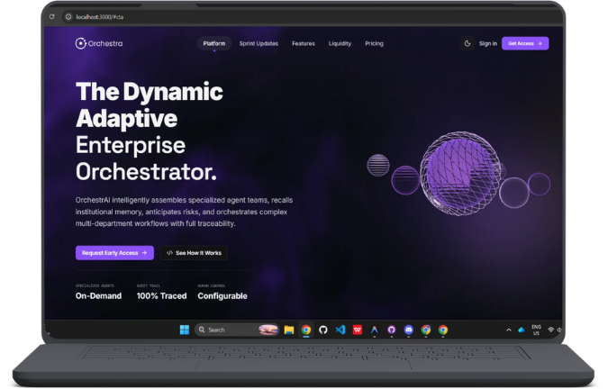
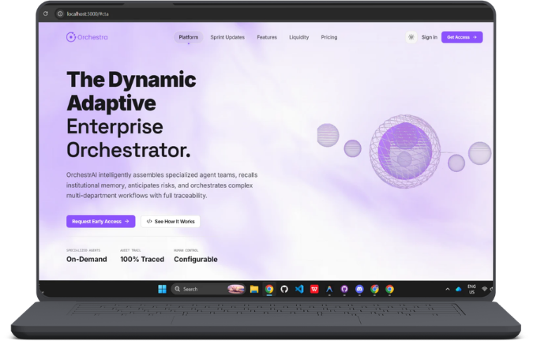

<p align="center">
  
</p>

# Orchestra Console

Orchestra is a multi-agent orchestration frontend built for high-security enterprise operations. It provides an interactive interface to submit, monitor, and audit compliance-constrained workflows.

---

## Project Architecture and Directory Structure

The project is built on Next.js 15 (App Router) and TypeScript. Below is the tree layout of the key directories:

```
src/
├── app/                      # Next.js App Router Pages and API Routes
│   ├── api/                  # Backend-proxy API endpoints
│   ├── auth/                 # Login page
│   ├── dashboard/            # Parent layout for admin views
│   │   ├── accounts/         # Keycloak user account provisioning
│   │   ├── employees/        # Directory of seeded vs onboarded hires
│   │   ├── graph/            # Workflow graph visualizer
│   │   ├── llm/              # LLM system configurations
│   │   ├── logs/             # Auditor logs viewer
│   │   ├── settings/         # Environment parameters
│   │   ├── veto/             # CISO, CFO, and DPO inbox veto console
│   │   └── page.tsx          # Overview analytics requests dashboard
│   ├── request/              # Multi-agent submit request page
│   ├── layout.tsx            # Global layout wrapper
│   └── page.tsx              # Public interactive landing page
├── components/               # Shared components
│   ├── auth/                 # Split-screen auth modules
│   ├── console/              # Sidebar shell navigation
│   ├── CTAForm.tsx           # Lead request form
│   ├── FeatureGrid.tsx       # Features with interactive hover glow
│   ├── Logo.tsx              # Responsive branding logo mark
│   └── Pricing.tsx           # Platform license details and models
└── lib/                      # Helper libraries
    ├── api.ts                # API client with automatic auth headers
    ├── auth-context.tsx      # React Context for login status tracking
    ├── db.ts                 # Database connectivity utilities
    └── keycloak.ts           # Token management and refresh logic
```

---

## Route Breakdown

### Public Views
* **`/` (Landing Page)**: Full-page dark-mode presentation showcasing product features, dynamic capabilities timeline, and platform licensing options.
* **`/auth` (Authentication)**: Split-screen sign-in panel integrated with the local Keycloak identity manager.

### Console Portal
All routes under `/request` and `/dashboard` are wrapped inside the sidebar console navigation framework:
* **`/request` (New Request)**: Interactive submission board with pre-set compliance test scenarios. Renders a live timeline of running agents, policy compliance hits, and download options for text logs.
* **`/dashboard` (Analytics)**: System overview displaying KPIs, approval rates, active blocks, and donut-chart breakdowns.
* **`/dashboard/employees` (Directory)**: Tracks seeded vs system-onboarded staff. Highlights active records created via automated HR workflows with a violet border and a Sparkles badge.
* **`/dashboard/graph` (Studio)**: Dynamic nodes graph showing data dependencies, running paths, and block points in the workflow.
* **`/dashboard/veto` (Governance Inbox)**: Action center for CISO, CFO, and DPO roles to manually approve or block pending items.
* **`/dashboard/logs` (Audit Trails)**: Chronological auditor log list with paginated filters and output viewing fields.
* **`/dashboard/accounts` (Accounts Manager)**: Administration view to provision new users and manage Keycloak credentials.
* **`/dashboard/llm` (LLM Config)**: Admin tools to update LLM engines, models, and temperatures.
* **`/dashboard/settings` (Settings)**: Interface to configure global endpoints, timeouts, and debug variables.

---

## Mockups and Interface

### Landing Page
Sleek dark-mode interface presenting our platform licensing models and core features.





### Dashboard Overview
Detailed requests overview showing status breakdowns, governance blocks, and recent runs.


---

## Technical Stack

* **Framework**: Next.js (App Router)
* **Styling**: Tailwind CSS
* **Animations**: Framer Motion
* **Type Safety**: TypeScript
* **Icons**: Lucide React

---

## Getting Started

### 1. Prerequisites
Ensure you have Node.js installed (version 18 or higher recommended).

### 2. Installation
Install project dependencies:
```bash
npm install
```

### 3. Environment Configuration
Create a `.env` file in the root directory:
```env
NEXT_PUBLIC_GATEWAY_URL=http://localhost:8000
```

### 4. Running Locally
Launch the development server:
```bash
npm run dev
```
Open [http://localhost:3000](http://localhost:3000) in your browser.
